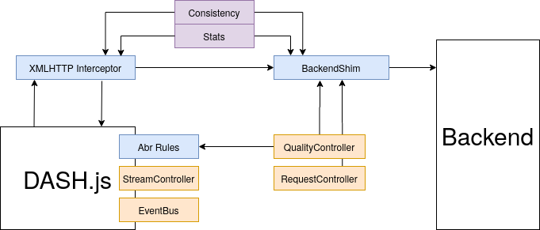

# DASH.js wrapper

The code contained in this folder is responsible for the front-end wrapper over `DASH.js`.

### Quickstart

The dependencies can be installed via:
```bash
npm install
```

Most of the code is written in **Typescript**(with small ECAMScript 6 parts). Hence, **Typescript** needs to be installed via NPM:
```bash
npm install -g typescript
```

To lint the **Typescript** code, run the command:
```bash
tsc
```

To build the Javascript wrapper module, one needs to run the command below. The list of supported arguments can be found in the `src/common/args.ts` script.
```bash
node build.js [arguments]
```

The build should generate 3 files in the `dist` folder:
```
bundle.js
config.json
video.json
```

After the build is successful, to test the video player, please follow the instruction from the following [README](../quic/README.md).

### System Design



At the lowest level in our implementation(blue) we have the XMLHTTP **interceptor**, the **BackendShim** and the **Abr Rules**. The XMLHTTP **interceptor** is used to enable the long-polling mechanism since DASH.js follows a push-based implementation. We intercept the outgoing requests and replace them with long polling requests with the purpose of allowing the backend to send the data as it considers fit.

At a higher level we have the **Stats** and **Consistency** modules(purple). The Stats module gathers stats from the shim as the back-end responds with new segments. The Consistency module checks that what DASH.js sees corresponds with the decisions taken by the backend.

At the highest level, we have the controllers and the event bus. The **QualityController** receives decisions from the **BackendShim** and passes them to the **Abr Rules**. The **EventBus** and **StreamController** are used to stop new segment downloads in the case we don’t have the current segment or a decision for a segment. The **RequestController** is responsible for keeping the long polling request pool.

### Project structure

The code of the whole frontend can be found in the `src` folder. The project structure(with most important files) looks as follows:
```bash
|-- src
|   +-- algo
|   |     +++++ folder containing all the front-end based ABR algorithms
|   |     +-- interface.ts -- ABR algorithm interface
|   +-- apps
|   |     +++++ folder containing the main entry point for each application
|   +-- common
|   |     +++++ utility structures
|   +-- component
|   |     +++++ low-level components
|   |     +-- abr.js -- ABR integration with DASH.js
|   |     +-- backend.ts -- HTTP shim for back-end communication
|   |     +-- intercept.ts -- XMLHTTP interceptor for default DASH.js requests
|   |     +-- stats.ts -- player metrics integration with DASH.js
|   +-- controller
|   |     +++++ high-level controllers
|   |     +-- quality.ts -- relays backend decisions to component/abr.js
|   |     +-- request.ts -- keeps the pool of long-polling requests
|   +-- index.js - entry point
|-- build.js
|-- index.html
```
