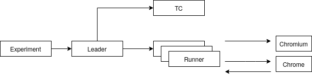

# Experiments

The code contained in this folder is responsible for setting up experiments and centralizing experimental results. The scripts works under an event-driven system implemented using Python's asyncio library.

### Quickstart

- To install the dependencies:
```bash
pip3 install -r requirments.txt
```
- Run the unit tests:
```bash
python3 -m unittest
```
- Run a custom experiment:
```bash
python3 experiments.py [experiment-name]
```

### Experimental pipeline

An experiment(`experiment.py`) is a set of individual runs(`run.py`) of multiple ABR clients competing on a bandwidth trace or over a fixed bandwidth. A leader(`leader.py`) is an asynchronous server that launches multiple runners and the TC controller(`scripts/network.py`). A runner(`run.py`) represents a single instance
of a Chromium backend server interacting with a Chrome instance that runs
our DASH.js wrapper.



The runner is implemented by a backend event buss(`server/server.py`) to which we attach components that react on incoming HTTP requests. The components(from the `components` folder and `crawler/traffic_gen.py`) are grouped together in controllers(`controller.py`, `leader.py`). The events that the runner listens to come from 2 sources:
- process async IO listeners(`server/process.py`)
- HTTP requests made by Chrome(check `BackendShim` from the [dash](../dash/README.md) documentation)

Besides the experimental pipeline, the `exp` folder contains the following components:
- `script/play.py` - life playback for experiment reproduction
- `crawler/traffic_gen.py` - TCP traffic(either short or long flows) generation
- `abr` - Python ABR implementation that can be used with `dash/src/algo/remote.ts` as explained [here](../dash/README.md)
- `exp_util/data.py, exp_util/plot.py` - utilities used to plot and centralize experimental results

### Setting up a new experiment

The experiments can be listed via:
```bash
python3 experiments.py --help
```

To make a new experiment, one needs to add Python code in the `experiment.py` file in a method decorated with the `@experiment` decorator. There are a list of useful functions in the `exp_util` folder:
- **run_subexp**: runs a list of individual `run.py` instances coordinated by a single leader over a fixed bandwidth shared link
- **run_trace**: runs a single individual `run.py` instance over a variable
- **run_traffic**: runs a single individual `run.py` instance over a fixed bandwidth shared link with background TCP traffic(either a long-running flow or shot flows)

To check what a `leader` and a `runner` can do and how they can be combined into an experiment, check the following commands:
```bash
python3 run.py --help
python3 leader.py --help
```
