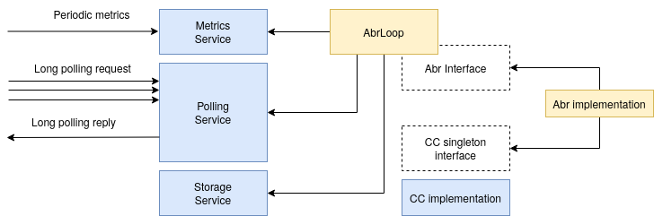

# Server-side ABR and Congestion Control

The code contained in this folder is responsible for the whole server-side.

### Quickstart

To install the server-side QUIC server, use the command below. Running the install should take a significant amount of time as the whole Chromium OS source tree has to be pulled from the Google servers.
```bash
./install.sh --install
```

After the installation has finished, the project can be built using:
```bash
./run.sh -b
```

To be able to test the backend server, you should install a Google Chrome version above 80. To test the installation, run in 2 separate terminals the commands:
```bash
./run.sh -s
./run.sh --chrome
```

Note the `run.sh` script is dependent on the `dash` component, hence we recommend to start with [that](../dash/README.md) install first.

### Development

The diagram below presents a high-level description of our server-side infrastructure. There are 2 loops that run inside the Chromium instance, each in a separate thread: the ABR loop and the main Chromium loop.

We implement a back-end that listens to HTTP-level events. We have a set of services which handle all incoming HTTP requests and setup events. The AbrLoop is started at server initialization and wakes at fixed periods. It fetches all new metrics received
from the front-end and decides the next segment based on the chosen ABR implementation.

We have 3 main services(HTTP handlers) with the following functionalities:
- metrics service: receives metrics from the front-end
- polling service: in-memory cache of all individual piece requests
- storage service: in-memory cache of all individual segments

The polling service responds keeps HTTP requests in-memory for the purpose of later access by the ABR loop. Long polling replies tell the Front-end both what piece should be downloaded and responds directly with the segment.



### Project structure

The communication schema between back-end and front-end is made using the JSON format. The front-end transmitted data scheme is preset in the file `src/net/abrcc/service/schema.*`, while the back-end transmitted data scheme is presented in the file `src/net/abrcc/abr/interface.*`.

The code of the whole backend can be found in the `chromium/src/net` folder. The project structure(with most important files) looks as follows:

```bash
|-- src/net
|   +-- abrcc
|   |   +-- cc
|   |      +++++ folder containing all CC-related functionality
|   |   +-- abr
|   |      +++++ folder containing all ABR-related functionality
|   |      +-- loop.* --> Chromium thread responsible for keeping the ABR loop
|   |      +-- interface.* --> ABR algorithm interface
|   |      +-- abr_* --> Individual ABR algorithm implementations
|   |   +-- service
|   |      +++++ folder containing QUIC request handlers
|   |      +-- poll_service.* -> in-memory cache of all individual piece requests
|   |      +-- store_service.* -> in-memory cache of all individual segments
|   |      +-- metrics_service.* -> receives metrics from the front-end
|   |   +-- structs
|   |      +++++ folder containing general-purpose structures and utilitiess
|   |   +-- dash_backend.* -> main back-end handler for QUIC individual requests
|   |   +-- dash_server.* -> main entry point
|   +-- BUILD.gn -> Ninja build file
```

### Implementing new ABR and CC classes

#### ► Adding a new ABR algorithm - C++
  - implement the interface `AbrInterface` from the file `quic/chromium/src/net/abrcc/abr/interface.h`
  - add algorithm in function `getAbr` from file `quic/chromium/src/net/abrcc/abr/abr.cc`
  - add the new algorithm `quic/run.sh`
  - add the new algorithm in `exp/run.sh`


  Basic ABR classes that inherit from `AbrInterface` can be found in the `quic/chromium/src/net/abrcc/abr/abr_base.*`. `SegmentProgressAbr` is a class that downloads the segments one after the other and makes the decision for the next segment when the download of a segments is at 80\%, allowing for continous streaming.

#### ► Adding a new CC algorithm
  - add a new algorithm in enumeration from `net/third_party/quiche/src/quic/core/quic_types.h`
  - implement the new algorithm by implementing the methods that `quic/chromium/src/net/abrcc/cc/cc_wrapper.cc` implements
  - add the new algorithm in `quic/chromium/src/net/abrcc/cc/cc_selector.cc`
  - add the new algorithm in `quic/run.sh`
  - add the new algorithm in `exp/run.sh`

#### ► CC-ABR interaction

Any singleton can be used for communication between CC and ABR:
```C++
#include "net/abrcc/cc/singleton.h"

class ExampleSingleton {
 public:
  void method() {
  }
}
```

Usage:
```C++
GET_SINGLETON(ExampleSingleton)->method();
```

Since the ABR and CC run on different threads, each class that inherits from singleton needs to protect it's data members. An example of a properly-implmented Singleton communication class is `BbrGap::BbrInterface` from the file `quic/chromium/src/net/abrcc/cc/gap.cc`.
